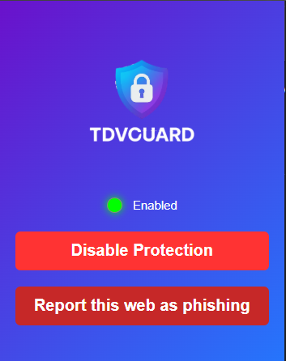
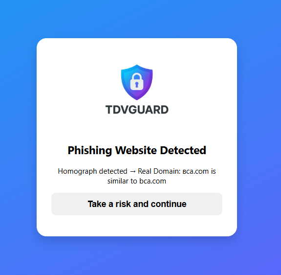

# 🛡️ Lightweight Browser-Based Phishing Detection System

  
  
  


> **A privacy-preserving, heuristic-based solution for detecting advanced Homograph and Typosquatting attacks in real-time.**

This repository contains the source code and datasets for the paper: *"A Lightweight Browser-Based Phishing Detection System using Optimized Homoglyph Mapping for Real-Time Protection"*. It features a **"Thin-Client, Heavy-Backend"** architecture designed to bypass the limitations of modern browsers and standard Unicode libraries.

* * *

---

## 📸 User Interface

| **Extension Popup** | **Phishing Warning Page** |
|:---:|:---:|
|  |  |
| *Real-time protection status and controls* | *User redirection upon detecting a threat* |

---

## 📂 Project Structure

The repository is organized into three main modules:

```text
├── 📂 extension/      # Frontend: The lightweight Chrome Browser Extension source code.
├── 📂 backend/        # Backend: Python Flask server handling detection logic & heavy processing.
└── 📂 testing/        # Research Data & Tools:
    ├── datasets csv                 # Benign and Synthetic Malicious datasets.
    ├── generate_malicious_dataset.py  # Script to generate synthetic attacks.
    ├── accuracy_testing.py       # Script for rule validation testing.
    └── real_domain_test.py       # Script for legitimate domain accuracy testing.


```

* * *

## 🚀 Getting Started

### 1\. Prerequisites

Ensure you have **Python 3.13.9** and **Google Chrome** installed.

### 2\. Installation & Dependencies

Clone this repository and install the required Python packages. It is recommended to use a virtual environment.

```
git clone https://github.com/biontdv/homograph_detection.git
cd homograph_detection
pip install -r requirements.txt
```

Required Dependencies (`requirements.txt`):

```
whois==1.20240129.2
unicodedataplus==16.0.0.post1
psutil==7.1.3
Flask==3.1.2  
flask-cors==6.0.2 
publicsuffix2==2.20191221
tldextract==5.3.0
Levenshtein==0.27.3
pybktree==1.1
```

* * *

## ⚙️ Configuration

Before running the system, please ensure the following configurations are set:

### A. Google Safe Browsing API Key

The system uses Google Safe Browsing as a final validation step.

1.  **Obtain an API Key:** Get your key from the [Google Cloud Console](https://console.cloud.google.com/).
    
2.  **Set the API Key:** Insert your API key into the configuration variable in the following three files:
    
    - `backend/google_safebrowsing.py`
        
    - `backend/utils/download_hash_googlesafe.py`
        
    - `backend/utils/update_hash_googlesafebrowsing.py`
        
3.  **Initialize Database (Important):** After setting the key, you **must run** the download script to fetch the initial blocklist database.
    
    Bash
    
    ```
    cd backend/utils
    python3 download_hash_googlesafe.py
    ```
    

### B. Selecting the Homoglyph Map (Advanced)

By default, the system uses our **Custom Resilience-Optimized Map**. If you wish to benchmark against the **Standard Unicode Confusables Map**:

1.  Open `backend/mapping.py`.
    
2.  **Uncomment** the function `muat_peta_homograf()` and the corresponding file path to load the standard map.
    
3.  Change file PATH on line 152
4.  Restart the backend server.
    

* * *

## 🖥️ Usage Guide

### 1\. Running the Backend Server

Navigate to the backend directory and start the Flask server:

Bash

```
cd backend
python3 app.py
```

*The server will start on `http://localhost:5000` (or your configured IP).*

### 2\. Installing the Browser Extension

1.  Open Google Chrome and navigate to `chrome://extensions/`.
    
2.  Enable **Developer mode** (top right corner).
    
3.  Click **Load unpacked**.
    
4.  Select the `extension/` folder from this repository.
    
5.  The extension is now active and will monitor URLs in real-time.

*API configuration locate at \Extension\scripts\heuristic.js line 6

### 3\. Manual API Testing

You can manually test the detection engine using `curl` or Postman:

Bash

```
curl --location 'http://ip:5000/sendurl' \
--header 'Content-Type: application/json' \
--data '{"url":"http://domain.com"}'
```

*(Replace `http://domain.com` with the URL you want to test)*

* * *

## 📊 Reproducibility & Testing

The `testing/` folder contains everything needed to reproduce the results presented in the paper.

- **Dataset Generation:** Run `generate_malicious_dataset.py` to create fresh synthetic samples based on various attack vectors (Homograph, Typosquatting, Mixed-Script).
    
- **Accuracy Testing:** Run `accuracy_testing.py` to evaluate the backend's detection rate against the dataset.
    
- **Legitimate Domain Test:** Run `real_domain_test.py` to check for False Positives using the Tranco Top 100.000 list (sample included).
    

* * *

## 📜 License

This project is open-source and available under the **MIT License**.

## 🤝 Contributing

Contributions are welcome! Please feel free to submit a Pull Request.

&nbsp;
